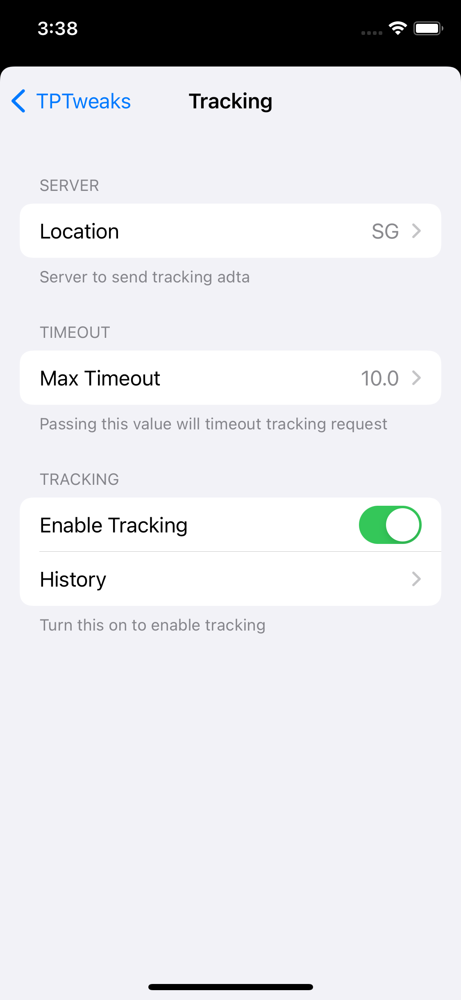
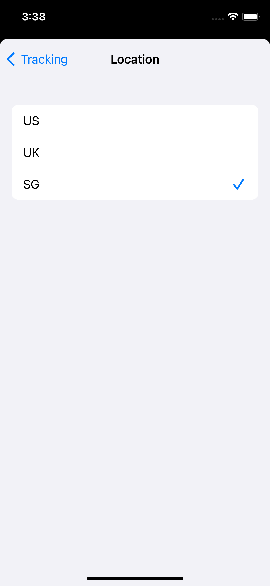
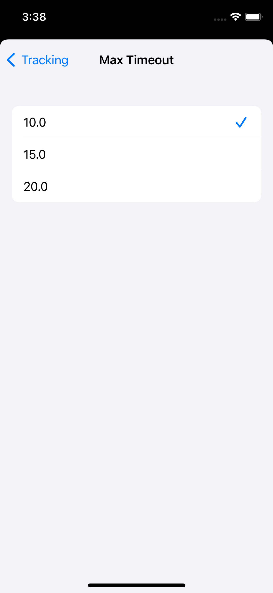
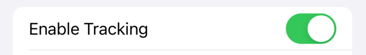
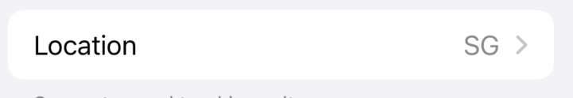
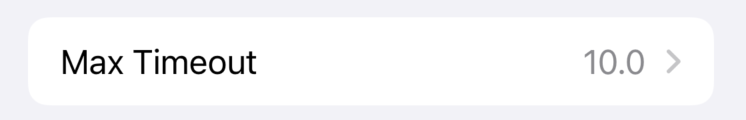

# TPTweak

TPTweak is a debugging tool to help adjust your iOS app on the fly without recompile.
inspired by facebook's [Tweak](https://github.com/facebookarchive/Tweaks), TPTweak is fully written in swift, and with simpler API.

|Example of TPTweak|Selecting options of string|Selecting options of number|
|----|----|----|
||||

# Installation
## Swift Package Manager
With xcode, add this URL
```
https://github.com/tokopedia/ios-tptweak
```

or manually add to your `Package.swift`
```swift
.package(url: "https://github.com/tokopedia/ios-tptweak", from: "1.0.0"),
```

# Cocoapods
add this to your `Podfile`
```
pod 'TPTweak', '~> 1.0.0'
```

# Nomenclature
`TPTweakEntry` = Representation of option on TPTweak

`TPTweakStore` = Brain of TPTweak, all logic of storing, reading and mutating value of TPTweak.
# TPTweakEntry
TPTweakEntry will represent a option on TPTweak.

```swift
TPTweakEntry(
    category: "Tracking",
    section: "Tracking",
    cell: "Enable Tracking",
    footer: "Turn this on to enable tracking",
    type: .switch(defaultValue: true)
)
```
- category: will be a cell on the first page
- section: will be a group of section on the second page
- cell: will be the name of the cell inside the section
- footer: add footer on the end of the section.(if multiply detected, will use the last one)
- type: the type of cell you want to use

### TPTweakEntry type
**Switch**


Using this type, you can create a cell with a UISwitch to enable/disable an option.You could also supply default value, if no value detected.

```swift
.switch(defaultValue: true)
```

**Strings**


Using this type, you can create a selection of strings.When user tap the options, it will automatically open the selection.

```swift
.strings(item: ["US", "UK", "SG"], selected: "SG")
```

**Numbers**


Using this type, you can create a selectio of numbers.When user tap the options, it will automatically open the selection.

```swift
.numbers(item: [10, 15, 20], selected: 10)
```

**Action**


Using this type, it gives you the flexibility to do everything. with given `closure`, you can for example, open custom page you create, or executing a `UserDefaults`, or more.

```swift
.action({
    UserDefaults.standard.set(true, forKey: "clear_cache")
    Cache.clear()
})
```

# How to Use

## Creating your TPTweakEntry
first you need to create your entry, we recommend to create an extension and put every entry definition as a static.

```swift
import TPTweak

extension TPTweakEntry {
    static let enableTracking = TPTweakEntry(
        category: "Tracking",
        section: "Tracking",
        cell: "Enable Tracking",
        footer: "Turn this on to enable tracking",
        type: .switch(defaultValue: true)
    )
}
```
## Registering your TPTweakEntry
once you create your entry, you need to register it to TPTweak so it will show up on TPTweak page. This can be achieved by calling `register()` on each entry.

You can call it whenever you want, but we suggest to put it on your `AppDelegate`'s `internal func application(_: UIApplication, didFinishLaunchingWithOptions _: [UIApplication.LaunchOptionsKey: Any]?)`

```swift
internal func application(_: UIApplication, didFinishLaunchingWithOptions _: [UIApplication.LaunchOptionsKey: Any]?) -> Bool {
        // register TPTweak Entry
        TPTweakEntry.enableTracking.register()
    }
```

## Openning TPTweak page

openning TPTweak is achievable by openning `TPTweakViewController`. but the easier way is to replace your `UIWindow` with `TPTweakShakeWindow`.

### Manual
```swift
// without nav
let viewController = TPTweakViewController()
self.navigationController?.pushViewController(viewController, animated: true)

// with nav
let tptweakWithNav = TPTweakWithNavigatationViewController()
self.present(tptweakWithNav)
```

### Shake (Recommended)
```swift
@UIApplicationMain
internal final class AppDelegate: UIResponder, UIApplicationDelegate {
    internal var window: UIWindow?

    internal func application(_: UIApplication, didFinishLaunchingWithOptions _: [UIApplication.LaunchOptionsKey: Any]?) -> Bool {
        // register TPTweakShakeWindow to enable openning TPTweak from shaking the device
        window = TPTweakShakeWindow(frame: UIScreen.main.bounds)
        ...
    }
}

```

# License
```
 Copyright 2022 Tokopedia. All rights reserved.

 Licensed under the Apache License, Version 2.0 (the "License");
 you may not use this file except in compliance with the License.
 You may obtain a copy of the License at

      http://www.apache.org/licenses/LICENSE-2.0

 Unless required by applicable law or agreed to in writing, software
 distributed under the License is distributed on an "AS IS" BASIS,
 WITHOUT WARRANTIES OR CONDITIONS OF ANY KIND, either express or implied.
 See the License for the specific language governing permissions and
 limitations under the License.
```
